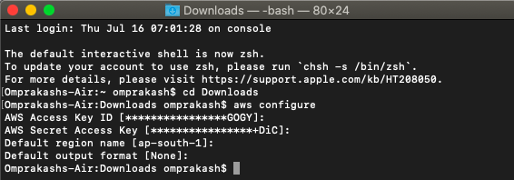
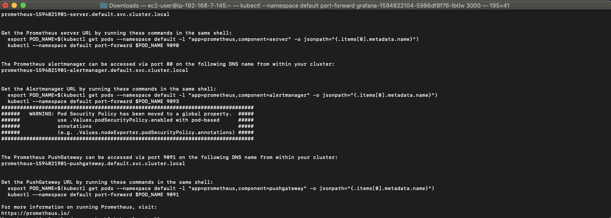
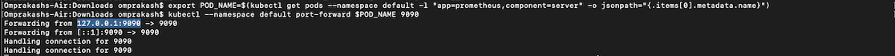
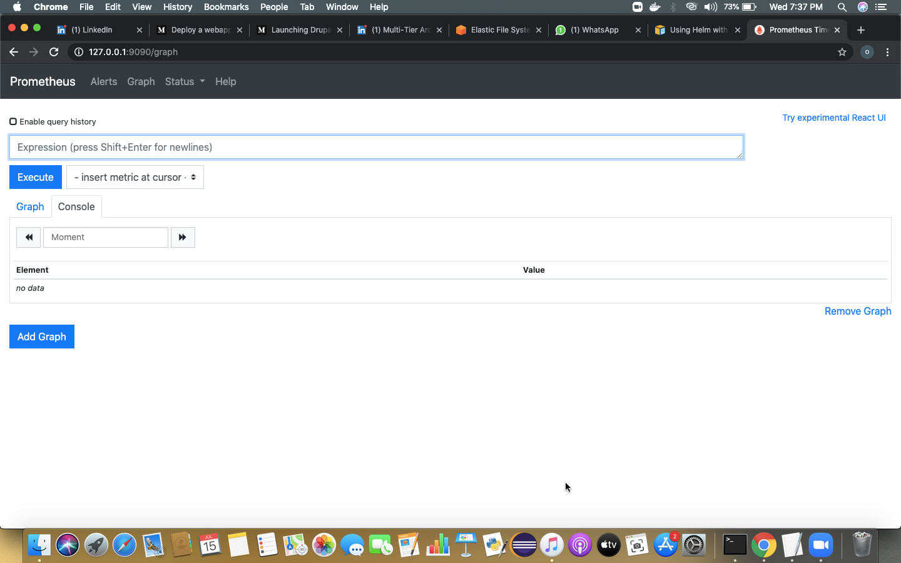
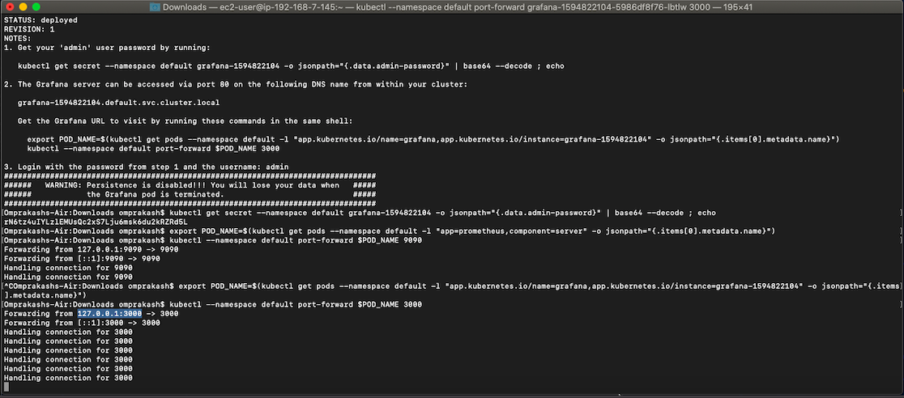

# AWS_EKS


## Elastic Kubernetes Service
EKS stands for Elastic Kubernetes Service, which is an Amazon offering that helps in running the Kubernetes on AWS without requiring the user to maintain their own Kubernetes control plane. It is a fully managed service by Amazon.

## eksctl
eksctl is a simple CLI tool for creating clusters on EKS - Amazon's new managed Kubernetes service for EC2. It is written in Go, and uses CloudFormation. You can create a cluster in minutes with just one command – eksctl create cluster !

we can connect to AWS via 3 ways
- webui
- CLI
- API (Terraform)

### CLI

For this first we require aws configure to login to the aws cloud and then we need eksctl command which is like a client command only build for EKS Service.
This will login to the aws in mumbai data center



```
hh
```




___


___


___


___

