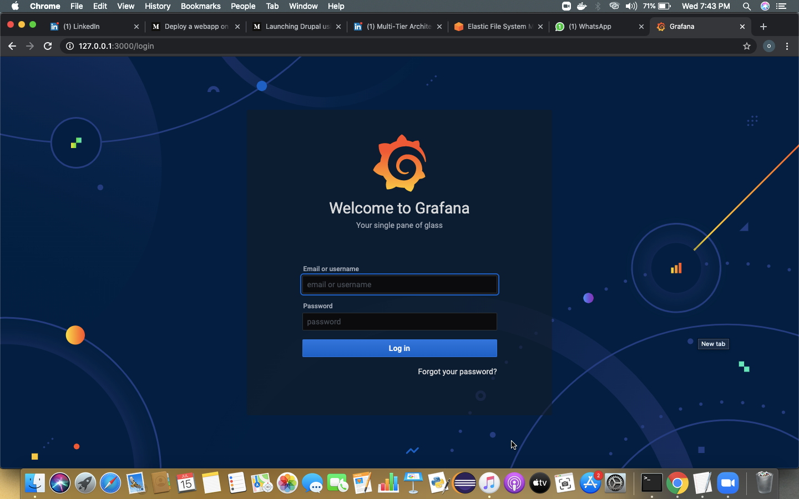

# AWS_EKS


## Elastic Kubernetes Service
EKS stands for Elastic Kubernetes Service, which is an Amazon offering that helps in running the Kubernetes on AWS without requiring the user to maintain their own Kubernetes control plane. It is a fully managed service by Amazon.

## eksctl
eksctl is a simple CLI tool for creating clusters on EKS - Amazon's new managed Kubernetes service for EC2. It is written in Go, and uses CloudFormation. You can create a cluster in minutes with just one command – eksctl create cluster !

we can connect to AWS via 3 ways
- webui
- CLI
- API (Terraform)

## CLI

## Settings required before connecting to EKS through CLI. Create one IAM user in as account with power “Admin “access.


For this first we require aws configure to login to the aws cloud and then we need eksctl command which is like a client command only build for EKS Service.
This will login to the aws in mumbai data center


## Method 1

## This is the YAML code to create eks cluster.

```
apiVersion: eksctl.io/v1alpha5
kind: ClusterConfig

metadata:
  name: sddcluster
  region: ap-south-1

nodeGroups:
  - name: ng1
    instanceType: t2.micro
    desiredCapacity: 2
    ssh:
      publicKeyName: Omos
  - name: ng2
    instanceType: t3.small
    desiredCapacity: 1
    ssh:
      publicKeyName: Omos 
```

## Now we can launch the cluster

```eksctl create cluster -f <clusterfile_name>```

## This will launch your EKS cluster. After launching this we have to configure the kubectl.

```aws eks update-kubeconfig --name <cluster_name>```

## So first create storage in EFS.


## Now we have to put the EFS dns name and file system id that we have created into the efs-provisioner file.

## we have created this file so that kubectl can access the EFS that is running on cloud

```
kind: Deployment
apiVersion: apps/v1
metadata:
  name: efs-provisioner
spec:
  selector:
    matchLabels:
      app: efs-provisioner
  replicas: 1
  strategy:
    type: Recreate
  template:
    metadata:
      labels:
        app: efs-provisioner
    spec:
      containers:
        - name: efs-provisioner
          image: quay.io/external_storage/efs-provisioner:v0.1.0
          env:
            - name: FILE_SYSTEM_ID
              value: xxxxxxxx
            - name: AWS_REGION
              value: ap-south-1
            - name: PROVISIONER_NAME
              value: efs-storage
          volumeMounts:
            - name: pv-volume
              mountPath: /persistentvolumes
      volumes:
        - name: pv-volume
          nfs:
            server: xxxxxxxxyyyyyyy.amazonaws.com
            path: /
```
## Create this file 

```kubectl create -f file.yml```

## For this it require some power that is know as role.

```
apiVersion: rbac.authorization.k8s.io/v1beta1
kind: ClusterRoleBinding
metadata:
  name: nfs-provisioner-role-binding
subjects:
  - kind: ServiceAccount
    name: default
    namespace: default
roleRef:
  kind: ClusterRole
  name: cluster-admin
  apiGroup: rbac.authorization.k8s.io
```
## Create this file 

```kubectl create -f file.yml```

## Now we have to install one utility “amazon-efs-utils” in all the worker nodes/instances. Because prometheus pod and grafana pod that will run over these nodes demand for EFS storage and It will work only when this utility will be avalilable in the nodes. we don’t know on which instance pod gonna launch so better to install utility in all instances.

```
ssh -i <key> -l <user> <public_ip> 
```
## Installing amazon-efs-utils 

```sudo yum install amazon-efs-utils -y
```

## This file “storage.yaml file” that will create one seprate SC ,PVC

```
kind: StorageClass
apiVersion: storage.k8s.io/v1
metadata:
  name: aws-efs
provisioner: efs-storage
---
kind: PersistentVolumeClaim
apiVersion: v1
metadata:
  name: efs-prometheus
  annotations:
    volume.beta.kubernetes.io/storage-class: "aws-efs"
spec:
  accessModes:
    - ReadWriteMany
  resources:
    requests:
      storage: 1Gi
---
kind: PersistentVolumeClaim
apiVersion: v1
metadata:
  name: efs-grafana
  annotations:
    volume.beta.kubernetes.io/storage-class: "aws-efs"
spec:
  accessModes:
    - ReadWriteMany
  resources:
    requests:
      storage: 1Gi
```
## Create this file 

```kubectl create -f file.yml```

## Creating one deployment for Prometheus and also creating service type-LoadBalancer.

```
apiVersion: v1
kind: Service
metadata:
  name: prometheus
  labels:
    app: prometheus
spec:
  ports:
    - port: 80
  selector:
    app: prometheus
    tier: backend
  type: LoadBalancer
---
apiVersion: apps/v1
kind: Deployment
metadata:
  name: prometheus
spec:
  replicas: 1
  selector:
    matchLabels:
      app: prometheus
      tier: backend
  strategy:
    type: Recreate
  template:
    metadata:
      labels: 
        app: prometheus
        tier: backend
    spec:
      containers:
      - name: prometheus
        image: prom/prometheus
        volumeMounts:
        - name: pro-volume
          mountPath: /etc/prometheus
        ports:
        - containerPort: 80
          name: prometheus
      volumes:
        - name: all-info
          persistentVolumeClaim:
            claimName: efs-prometheus
```
## To create this

```kubectl create -f file.yml```

## Creating one deployment for Grafana and also creating service type-LoadBalancer.

```
apiVersion: v1
kind: Service
metadata:
  name: grafana
  labels:
    app: grafana
spec:
  ports:
    - port: 80
  selector:
    app: grafana
    tier: frontend
  type: LoadBalancer
---
apiVersion: apps/v1 
kind: Deployment
metadata:
  name: grafana
  labels:
    app: grafana
    tier: frontend
spec:
  selector:
    matchLabels:
      app: grafana
      tier: frontend
  strategy:
    type: Recreate
  template:
    metadata:
      labels:
        app: grafana
        tier: frontend
    spec:
      containers:
      - image: grafana/grafana:latest
        name: grafana
        ports:
        - containerPort: 80
          name: grafana
        volumeMounts:
        - name: all-info
          mountPath: /var/lib/grafana
      volumes:
      - name: all-info
        persistentVolumeClaim:
          claimName: efs-grafana
```
## To create this

```kubectl create -f file.yml```

## To delete the complete cluster

```eksctl delete cluster sddcluster```

## Method 2

## Helm is a Kubernetes-based package installer. It manages Kubernetes “charts”, which are “preconfigured packages of Kubernetes resources.” Helm enables you to easily install packages, make revisions, and even roll back complex changes.

## For setting up the HELM we have to run following commands-

## helm repo add stable https://kubernetes-charts.storage.googleapis.com/


## helm repo list
## helm repo update

## helm install stable/prometheus


## to expose promethesu
___


## promethesu web UI
___


## helm install stable/grafana
___


## grafana web UI
___



## Thank you to read same will be uploaded on Linkedin soon
